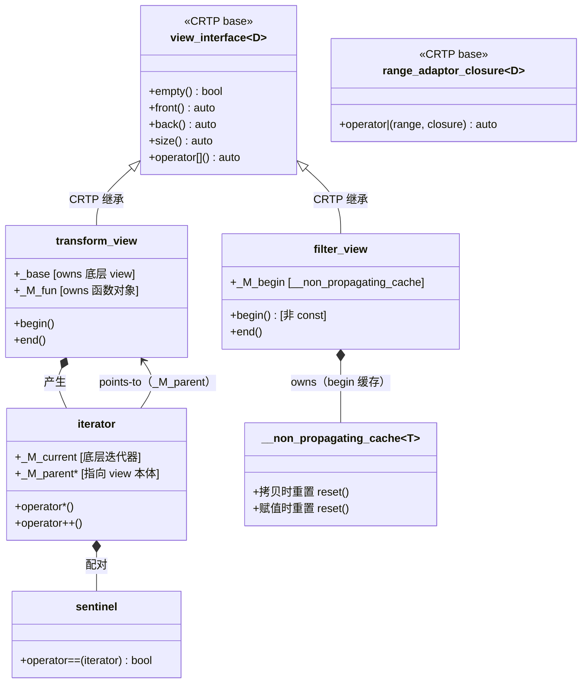

# 笔记 01：实现层对象关系图

> 对应任务 1 / 验收点：出现 view_interface / range_adaptor_closure / iterator / sentinel / cache 五节点；
> 每条边标注"持有（owns）"或"指向（points-to）"；`__non_propagating_cache` 节点有"拷贝时重置"标注。

---

## 占位骨架（用 ASCII 或 mermaid 填写）

```
【填写实现层对象关系图】

示例起点（Mermaid，取消注释后在支持渲染的编辑器预览）：

---

---

TODO：
- [ ] 补全 join_view 的双层迭代器节点（外层 _M_outer + 内层 _M_inner）
- [ ] 补全 single_view 的 movable-box 持有节点
- [ ] 补全 iota_view 的"无 parent 指针"说明（borrowed_range 成立的原因）
- [ ] 在每条继承/持有/指向边上标注方向和语义
```

---

## 关键节点说明（阅读后填写）

| 节点 | 职责 | 与其他节点的关系 |
|------|------|------------------|
| `view_interface<D>` | CRTP 注入 empty/front/back/size/operator[] | 被所有 view 继承 |
| `range_adaptor_closure<D>` | CRTP 注入 operator\| | 被所有 closure 类型继承 |
| `iterator`（内嵌类） | 持有底层迭代器 + parent 指针 | 指向（points-to）view 本体 |
| `sentinel` | 标记范围结束，类型可与 iterator 不同 | 与 iterator 配对比较 |
| `__non_propagating_cache<T>` | 缓存 begin 位置；**拷贝时重置**（non-propagating） | filter_view / join_view 持有 |

---

*填写完成后删除此行提示，保留图表与说明。*
