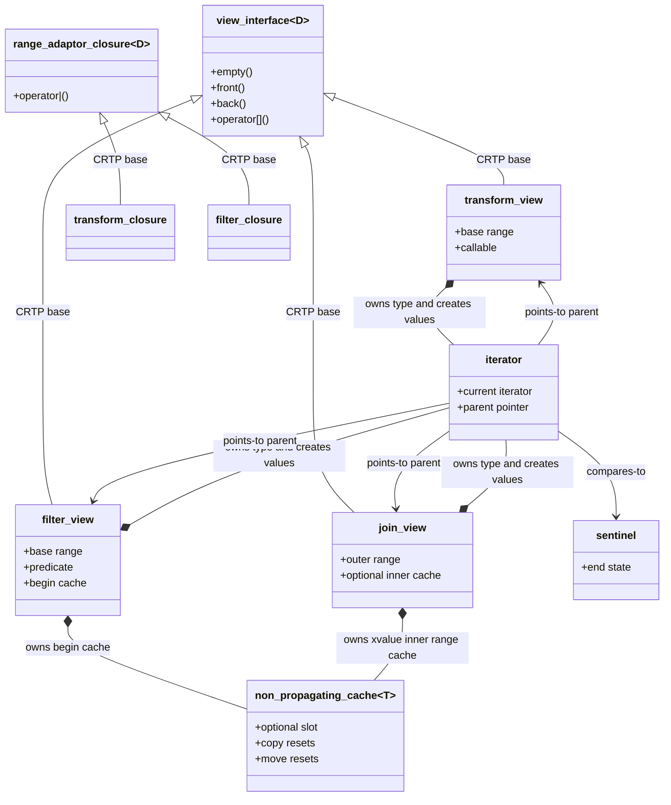

# 笔记 01：实现层对象关系图

固定输入：MSVC STL 145，`_MSVC_STL_UPDATE=202604L`，本机源码目录
`D:/VisualStudio2026/Installed/VC/Tools/MSVC/14.51.36231/include`。行号升级后会漂移，按
`single_view`、`transform_view`、`filter_view`、`join_view`、`_Cached_position` 重新定位。

`single_view` 是完成型 view：对象自己持有一个元素，`begin/end` 可以直接暴露元素地址。
`transform_view`、`filter_view`、`join_view` 都是依赖型 view：迭代器不仅持有当前位置，还要能回到 parent
读取函数对象、谓词或内层状态。`filter_view` 的 cache 缓存第一次 `begin()` 扫描结果，拷贝和移动时重置，
保证新 view 不继承旧 view 的迭代状态。`join_view` 的 cache 解决另一个问题：当外层解引用产生 xvalue 子范围时，
必须把那个临时子范围本体稳定在 view 内，否则内层迭代器会指向已结束生命期的对象。
