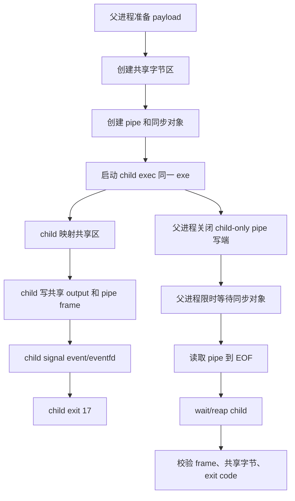

# 09. 进程创建、exec 与可回收边界

进程不是“函数调用的重版本”。函数调用共享同一个地址空间、同一组 C++ 对象和同一条异常传播链；进程创建只共享操作系统显式允许共享的资源，例如继承句柄、文件描述符、共享映射、环境变量和命令行。C++ 析构、`std::mutex`、普通指针和引用不会跨进程保持语义。

本节只做一个可验证闭环：父进程启动同一个可执行文件的 child 模式，把共享内存和同步对象交给 child，child 处理未知 payload 后退出，父进程限定时间等待、读取结果、回收 child。它不讲 daemonize、`setsid`、服务管理器和作业调度。

## 因果链

父进程需要从 child 得到结果，所以必须先回答三个问题。

第一，child 如何找到要执行的程序。Windows 使用 `CreateProcessW`，本课固定传显式 `lpApplicationName`，并把 `lpCommandLine` 放入可修改缓冲区，因为 Win32 允许该调用改写命令行。Linux 使用 `fork` 后 `execv`，父侧先准备好字符串和 `argv`，child 分支只做 `close`、`execv`、`_exit` 这类允许操作；如果 `execv` 失败，直接 `_exit(127)`，不跑继承来的 C++ 析构。

第二，child 能拿到哪些资源。Windows 默认“可继承句柄”太宽，本课优先用 `STARTUPINFOEX` 的 handle-list，只列出 pipe 写端、file mapping 和 event。Linux 默认 fd 会跨 `exec` 保留，除非带 `FD_CLOEXEC`；本课只把共享文件 fd、`eventfd` 和 pipe 写端留给 child，其它端在父子两侧关闭。

第三，父进程如何结束等待。等待不是睡眠轮询。Windows 等 event 和 process handle；Linux 等 `eventfd` 和 `waitpid`。如果超时，只杀自己刚启动的 child，再 `waitpid`/`WaitForSingleObject` 收尸。清理失败是测试失败，不被当成“学生实现拒绝”。

## 资源状态图



## 关键代码形状

练习入口是：

```cpp
c07_l06::ProcessResult run_process_ipc(
    const std::filesystem::path& executable,
    std::string_view payload,
    const std::filesystem::path& witness_path,
    c07_l06::ChildMode mode,
    std::chrono::milliseconds timeout);
```

checker 把 `argv[0]` 作为 `executable`，payload 是运行时构造的未知字节串，`witness_path` 位于 supervisor 私有临时目录。学生实现必须真的启动 child，并让 child 通过共享字节区、pipe 和 witness 文件返回数据。只返回 `ok=true` 或 echo 参数会被 bad fixture 拒绝。

Windows 的最小关键点：

```cpp
std::vector<wchar_t> mutable_command(command.begin(), command.end());
mutable_command.push_back(L'\0');
CreateProcessW(app.c_str(), mutable_command.data(), nullptr, nullptr, TRUE,
    EXTENDED_STARTUPINFO_PRESENT | CREATE_NO_WINDOW,
    nullptr, nullptr, &startup.StartupInfo, &pi);
```

Linux 的最小关键点：

```cpp
std::array<char*, 7> argv{exe.data(), arg1, mode.data(), map_fd.data(), event_fd.data(), pipe_fd.data(), nullptr};
pid_t pid = fork();
if (pid == 0) {
    close(read_end);
    execv(exe.c_str(), argv.data());
    _exit(127);
}
```

这里的 `argv` 字符串在父侧先构造好。child 分支不分配、不抛异常、不写 C++ 日志。

## 练习 Parts

Part 1：实现正常父子链。创建共享区，写入 payload，启动 child，读取 pipe frame，等待 child exit 17，并验证共享区里的 output 与 pipe 里的 frame 一致。

Part 2：实现失败输入。不存在的 child 路径必须返回受控错误，不得留下半创建资源。

Part 3：实现短帧和 peer close。child 写短帧或直接关闭 pipe 时，父进程读到 EOF，但不能把 EOF 当成功。

Part 4：实现异常退出。child exit 42 时，父进程仍要回收 child，并报告 exit mismatch。

Part 5：实现 timeout。child 睡眠超过限定时间时，父进程只终止自己启动的 child，然后等待回收。

## 最小命令

```sh
cmake --build C07_OS_Memory_System_IO/exercises/build/verify-debug --config Debug --target L06_process_ipc_reference
ctest --test-dir C07_OS_Memory_System_IO/exercises/build/verify-debug -C Debug -R L06_process_ipc
```

完整矩阵由父级验证脚本统一运行；本题自身不安装依赖，也不依赖 C08。


