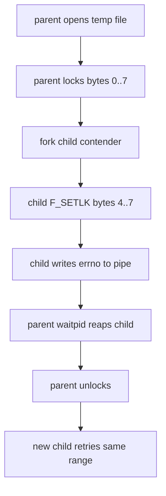
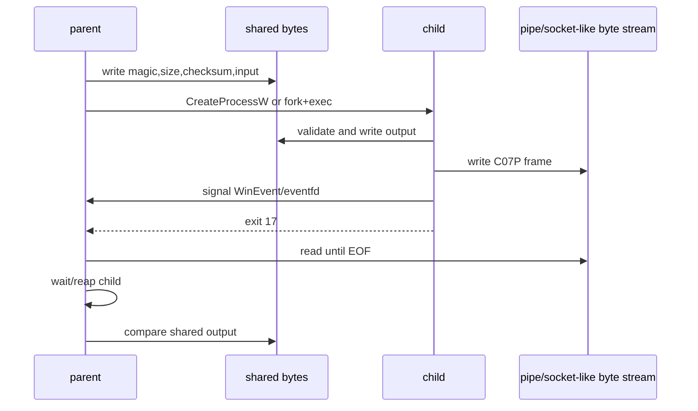

# 10. IPC：字节布局、同步与 peer 关闭

IPC 的核心问题不是“把对象发过去”，而是“把双方都能解释的字节放到哪里、什么时候算写完、另一端消失时怎么收束”。普通 C++ 对象图包含地址、allocator、锁和生命周期；这些东西在另一个进程里没有同一个含义。本课只传固定字节布局。

## 显式字节布局

L06 的共享区是一个固定结构：

```cpp
struct SharedBlock {
    std::uint32_t magic;
    std::uint32_t size;
    std::uint32_t checksum;
    std::uint32_t state;
    std::array<unsigned char, 128> input;
    std::array<unsigned char, 128> output;
};
```

`magic` 说明这块内存是本协议；`size` 限定有效字节数；`checksum` 让 child 拒绝错 fd、短映射或未初始化输入；`state` 标记 child 已写完；`input/output` 是固定容量 payload。所有字段都是整数和字节数组，没有指针，没有引用，没有 `std::mutex`，也没有跨进程 `std::atomic` 承诺。

## 同步选择

Windows 用 manual-reset event。event 是内核对象，可以通过继承句柄传给 child；child 写完共享区后 `SetEvent`，父进程用 `WaitForSingleObject` 限时等待。

Linux 用 `eventfd`。它是 fd，可以跨 `fork`/`exec` 保留；child 写入 `uint64_t{1}`，父进程用 `select` 限时等待，再读掉这个计数。这里不用 `std::condition_variable`，因为它只定义同一进程内的等待语义。

pipe 只负责传输 frame：

```text
4 bytes magic: "C07P"
4 bytes little-endian length
N bytes transformed payload
```

共享区、pipe 和 child witness 都必须匹配，才算成功。witness 文件由 checker 私有 child fixture 写入，记录 child pid 与运行时 payload 结果。这样 checker 能区分“共享区写对但 pipe 短帧”“pipe 写对但共享区未同步”“没有真实 child 只合成报告”“child 提前退出”等不同故障。

## peer 关闭为什么不是成功

pipe EOF 只说明所有写端都关闭了，不说明协议完成。正常完成必须同时满足：

1. 同步对象已发出完成信号。
2. pipe frame 完整。
3. 共享区 `state` 和 output 正确。
4. witness 中的 pid 与父进程观察到的 child pid 一致。
5. child 已退出，exit code 是约定值。
6. child 已被父进程回收。

缺任意一项，都是受控失败。

## 字节锁：保护范围，不保护抽象对象

文件锁也是 IPC，但它保护的是文件中的字节范围，不是 C++ 对象。Windows `LockFileEx` 可以请求 exclusive/shared byte-range lock；配合 `LOCKFILE_FAIL_IMMEDIATELY` 时，如果范围不能立即取得锁，调用直接失败。官方文档还说明：同一进程重新打开同一个文件得到第二个 handle，也不能通过第二个 handle 访问已经锁住的范围，直到解锁；但内存映射视图不受这种 byte-range lock 阻止。

Linux 的 POSIX `fcntl(F_SETLK)` record lock 是 advisory lock。它只在合作进程之间有意义；普通 `read`/`write` 不会因为 advisory lock 自动失败。更容易踩坑的是它的归属：传统 record lock 是 process-associated，同一进程内多个 fd 共享锁状态，不能用“两次 open 同一文件”在同一进程里伪造冲突测试。所以 L06 的观察入口必须 `fork` 一个 child，让 child 在另一个进程里尝试重叠 `F_WRLCK`，再由 pipe 把 `errno` 回传给 parent。



这个观察只证明平台锁的基本边界：重叠拒绝、非重叠可并行、解锁后可重试。它不把 advisory lock 说成强制访问控制，也不把 Windows byte lock 说成能拦住 mapped view。Linux 同一观察还演示 `pread`/`pwrite` 使用显式 offset，不推进共享 file offset；这和“用文件描述符当前 offset 当协议状态”是两套语义。

## 流程图



## 逐 Part 解析

Part 1 校验正常路径。payload 是 checker 生成的未知字节，不是学生代码里的常量。实现必须消费 `executable` 和 `payload`。

Part 2 校验部分创建。路径不存在时，Windows `CreateProcessW` 失败，Linux `execv` 失败后 child `_exit(127)`；父进程不能崩溃，也不能挂住。

Part 3 校验协议短帧。child 只写 `"C"`，父进程会读到 EOF，但 frame 长度不够，所以返回失败。

Part 4 校验 peer close。child 不写 pipe，只 signal 并退出；父进程看到 EOF，也必须按协议失败。

Part 5 校验 timeout。child 睡眠，父进程按限定时间收束，并保证 child 已回收。

## 最小命令

```sh
cmake --build C07_OS_Memory_System_IO/exercises/build/verify-core --config Release --target L06_process_ipc_reference
ctest --test-dir C07_OS_Memory_System_IO/exercises/build/verify-core -C Release -R L06_process_ipc
```

本节的“socketpair”思想是全双工 fd 对；本题选 pipe 是为了保持实验最小。完整服务间协议、线程池、插件框架和后台守护进程不在本节范围。


