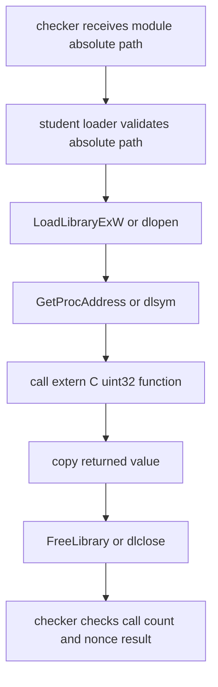

# 15. 动态装载：绝对路径、C ABI 与卸载生命期

动态装载把“链接时决定”改成“运行时决定”。这不是插件框架的同义词。真正需要先掌握的是：从哪里加载、找哪个导出符号、函数 ABI 是否稳定、谁拥有模块内分配的资源、什么时候可以卸载。

本课只做一个共享库模块：

```cpp
extern "C" uint32_t c07_module_mix(uint32_t a, uint32_t b, uint32_t nonce);
```

导出函数使用 `uint32_t`，所有算术都是无符号整数运算，避免 signed overflow。checker 把 CMake 生成的 `$<TARGET_FILE:L09_dynamic_loading_module>` 绝对路径传给练习程序。

## 因果链

第一，加载路径必须明确。Windows 使用 `LoadLibraryExW(abs_path, ..., LOAD_LIBRARY_SEARCH_DLL_LOAD_DIR | LOAD_LIBRARY_SEARCH_SYSTEM32)`；Linux 使用 `dlopen(abs_path, RTLD_NOW | RTLD_LOCAL)`。本题拒绝相对路径，不修改全局 DLL 搜索路径，也不依赖当前工作目录。

第二，符号名是 C ABI。C++ 函数名会 mangling，不适合跨编译单元按字符串查找；模块导出使用 `extern "C"`，Windows 加 `__declspec(dllexport)`，Linux 加 `visibility("default")`。

第三，符号查找失败必须能区分。Windows `GetProcAddress` 返回 null 后查 `GetLastError`。Linux `dlsym` 返回 null 不一定代表失败，所以调用前清空 `dlerror()`，调用后再读 `dlerror()`。

第四，卸载之后不能再调用函数指针。函数指针只在模块 handle 活着时有效。本题的实现加载、查符号、调用、保存返回值、释放本次打开的 handle，然后返回结果；不把函数指针泄漏给调用者。checker 会另外持有 observer handle 来读取调用计数，因此不把“全局模块已经卸载”作为本题证明目标。

## 状态图



## 关键代码形状

练习入口：

```cpp
c07_l09::ModuleResult load_module_add(
    const std::filesystem::path& library,
    std::string_view symbol,
    std::uint32_t a,
    std::uint32_t b,
    std::uint32_t nonce);
```

Windows 最小形状：

```cpp
HMODULE module = LoadLibraryExW(path.c_str(), nullptr,
    LOAD_LIBRARY_SEARCH_DLL_LOAD_DIR | LOAD_LIBRARY_SEARCH_SYSTEM32);
auto fn = reinterpret_cast<c07_l09::module_mix_fn>(
    GetProcAddress(module, "c07_module_mix"));
auto value = fn(a, b, nonce);
FreeLibrary(module);
```

Linux 最小形状：

```cpp
void* module = dlopen(path.c_str(), RTLD_NOW | RTLD_LOCAL);
dlerror();
void* symbol = dlsym(module, "c07_module_mix");
const char* error = dlerror();
auto fn = reinterpret_cast<c07_l09::module_mix_fn>(symbol);
auto value = fn(a, b, nonce);
dlclose(module);
```

## 逐 Part 解析

Part 1：加载 CMake 构建出的模块绝对路径，查找 `c07_module_mix`，用 checker runtime nonce 调用并返回 `uint32_t` 结果。checker 同时读取模块调用计数，证明被测 loader 真的调用了 DLL/SO。

Part 2：拒绝缺失符号。checker 传入不存在的符号名，假装成功会被拒绝。

Part 3：拒绝缺失库。loader 必须把加载失败变成受控错误。

Part 4：拒绝相对路径。本题不训练搜索路径策略，只训练明确模块边界。

Part 5：handle 生命期。结果值可以返回；模块内函数指针、模块内分配对象不能在释放 handle 后继续使用。若以后要演示模块分配，规则是“谁创建谁销毁”：模块导出 `create` 时也要导出匹配的 `destroy`。

## 最小命令

```sh
cmake --build C07_OS_Memory_System_IO/exercises/build/verify-debug --config Debug --target L09_dynamic_loading_reference
ctest --test-dir C07_OS_Memory_System_IO/exercises/build/verify-debug -C Debug -R L09_dynamic_loading
```

本节不实现 registry、插件发现、热更新和 ABI 版本协商。这些是后续工程主题，不是本题的最小可验证目标。


