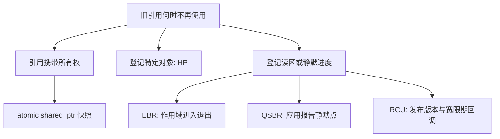

# 从发布走到生命期：为何“晚一点 delete”仍然没有证明

这一篇连接第 10 章的发布与对象生命期。先回答“读到了初始化后的值”，再回答“读的时候对象还活着”。这两个问题不能用同一次 acquire 含混带过。本文的有限状态反例和引用计数 reference 都在 [lifetime_reference.cpp](lifetime_reference.cpp)，正常运行不会真的制造未定义行为。

## 1. 朴素延迟释放缺的是什么

设全局原子源指针为 P，初始指向 A。读者 R 执行 `p = P.load()` 后被调度器暂停；写者 W 把 P 换成 B，再释放 A。R 恢复后对 p 解引用，即使 P 的全部访问都是 SC，A 的生命期也已经结束。原子的是 P 中存放的值，不是“从取指针到用完对象”这一段复合操作。

| 次序 | 读者 R | 写者 W | A 的状态 |
|---|---|---|---|
| 1 | 从 P 取出 A 的地址 | | 活着，源可达 |
| 2 | 被暂停，尚未解引用 | P.exchange(B) | 活着，已摘除 |
| 3 | 仍未运行 | 等 100 个时间单位 | 活着，但没有新的生命期证据 |
| 4 | 仍未运行 | delete A | 生命期结束 |
| 5 | 恢复并尝试使用 p | | 已不能合法访问 |

把 100 改成一秒、一分钟或者“等一百次更新”都不能补上证明：线程可能一直未获调度，也可能停在调试器里。reference 的 `delay_is_not_protection()` 只安排这一合法的调度前缀，并检查“读者仍持有地址，但对象已被模型标记为死亡”的状态。随后停止模拟；它没有借崩溃来证明错误，也没有让错误代码进入性能排名。

永不释放能排除这里的 delete，却把问题改成无限保留内存。它适合作为有明确对象数上限的推导起点，不能包装成完整回收方案。另一个真正可行的基线是读写双方使用同一互斥锁，并让读者在锁内完成全部访问。此时锁覆盖的范围才提供生命期保证；只给读指针那一行加锁依然不够。

我们需要的证据不是“已经过了足够长时间”，而是“所有可能保有旧引用的使用者都结束了相关使用”。后面的方案只是收集这种证据的不同方式。

## 2. 先让引用本身携带所有权

最直接的分支是把发布单元换成 `atomic<shared_ptr<const T>>`。加载产生的强引用本身负责延长生命期，读者持有它期间，写者替换源不会撤销读者已经拥有的强引用。reference 中的 `reference_count_branch()` 按下面顺序执行实际标准库代码：

1. 发布值为 42 的对象；加载一份名为 owned 的强引用。
2. 清空发布单元；检查对象仍未析构，owned 仍可读取 42。
3. 释放 owned；检查恰好发生一次析构，weak_ptr 已过期且 lock 失败。

这里不需要手写“先取裸指针，再增加计数”的窗口。后者会在计数增加之前就遇到对象消亡；原子的 shared_ptr 加载把取得所有权包含在操作里。这是标准设施解决的核心困难。[N5050](https://www.open-std.org/jtc1/sc22/wg21/docs/papers/2026/n5050.pdf) 的 `[util.smartptr.atomic.shared]` 给出相关语义。它不是让任意用户自己拼出来的控制块加计数代码自动变安全。

边界也要拆开看。不同 shared_ptr 实例可以共享控制块，但并发改写同一个普通 shared_ptr 变量仍需同步；用 atomic 特化解决的是发布单元本身的竞争。强引用保护生命期，不保护 T 的可变字段；本例使用 const 快照，写者每次造新版本。若只保存 `current.load().get()`，临时强引用在完整表达式末尾消失，裸指针就失去这一保护。循环强引用还可能导致所有权环，应在设计上切断环，不能期待引用计数识别不可达的循环。

reference 打印本次 `is_lock_free()`，它是当前对象/实现的报告，不是所有标准库的结论。即便某实现报告 true，也不能据此把分配、T 的析构和最后一个强引用释放都算成 lock-free。反过来，报告 false 也没有测出具体锁的布局和性能。读少写少、快照规模小、对象需要跨任务保存时，强引用常常已经满足需求；进入 HP 或 RCU 分支应当出于契约需要，而非默认性能排名。

## 3. ABA 是值历史问题，生命期是访问资格问题

另一种失败是比较值掩盖历史：读者保存 A；其他线程令源 A→B→A；CAS 比较到的还是 A，可能错误地认为中间没有变化。A 可以是复用同一地址的新对象，也可以是一直活着、被摘下后又重新插入的同一个节点。第二种情况说明 ABA 不要求发生 delete。

`aba_branch()` 用整数地址编号安全模拟 A→B→A。地址比较会接受，附带的 generation 比较拒绝这一次变化。紧接着，它保留“旧生命期已经结束”的状态，说明增加标签没有赋予解引用资格。即使最后 CAS 必然失败，程序也可能早在读取 `old->next` 时就访问了死亡对象。标签是在比较时检验历史，不是在访问期间留住对象。

有限位数的标签还会回绕。reference 用 2 位标签完成四次变化，再回到原值；这不是 CPU 的偶发行为，而是有限状态空间的必然后果。工程中可以用足够宽的计数配合可证明的操作界限，或使用其他协议，但不能只写“有版本号，所以没有 ABA”。

HP 能阻止已成功保护的对象被回收复用；若应用允许把仍受保护的同一节点重新插回去，逻辑 ABA 仍可能存在。本专题栈明确禁止重新发布已摘除节点，并让 next 在首次发布后保持不变。这个结构契约与 HP 的生命期契约一起，才支撑后面的 CAS 推导。

## 4. 这是分支，不是淘汰赛

HP 适合一次只需保护少数节点、希望停顿读者仅拖住有限对象的结构。EBR 用一个读区覆盖一批访问，代价是一个长读区能阻挡许多退休对象。QSBR 利用事件循环等应用结构里的自然静默点，要求应用确实执行这些报告。RCU 是读者与更新者协作的接口/设计方式，其宽限期可以用分代或其他机制实现；QSBR 也可以成为 RCU 的一种实现风格。它们并非四个绝不相交的集合。

本课程的 EBR、QSBR、RCU 共享一个可读的短锁分代核心，使“静默证据来自哪里”成为实验变量。它们不声称复现工业实现的读侧成本。继续读 [HP](02-hazard-pointers.md)、[EBR](03-epoch-reclamation.md)、[QSBR](04-qsbr.md)、[RCU](05-rcu.md)，最后按 [验证与集成说明](06-validation.md) 运行全部检查。

## 5. 自测与解析

**题一：release 发布配 acquire 加载，为什么还要回收协议？** 这对同步用于把构造写入传给读者。它没有告诉写者什么时候读者结束了解引用。已发布且已初始化的对象仍然可能过早死亡。

**题二：等待 100 ms 不正确，那么增加一把锁正确吗？** 只有读者整个访问过程与摘除/释放遵循同一把锁的互斥约束才正确。单独保护源指针的一次读取仍留下锁外访问窗口。

**题三：shared_ptr 能否让两线程同时修改 payload？** 不能。它延长生命期；数据竞争必须通过不可变快照、原子字段或互斥处理。

**题四：HP 加标签能否支持任意复用节点？** 不能据此下结论。需要分别证明访问资格、标签回绕界限、节点字段并发修改及摘插状态机。本题固定“不重新发布”的结构约束。

**复现：** 在仓库根目录的 x64 MSVC Developer PowerShell 单独编译本目录 `lifetime_reference.cpp`，或运行专题 `verify.ps1` 的默认 Reference 模式；精确命令见 [验证说明](06-validation.md)。预期三项检查 PASS，lock-free 报告以本机实际值为准。四道作业的 main 是独立空 starter，未完成时预期返回 1；脚本默认不运行学生入口。
