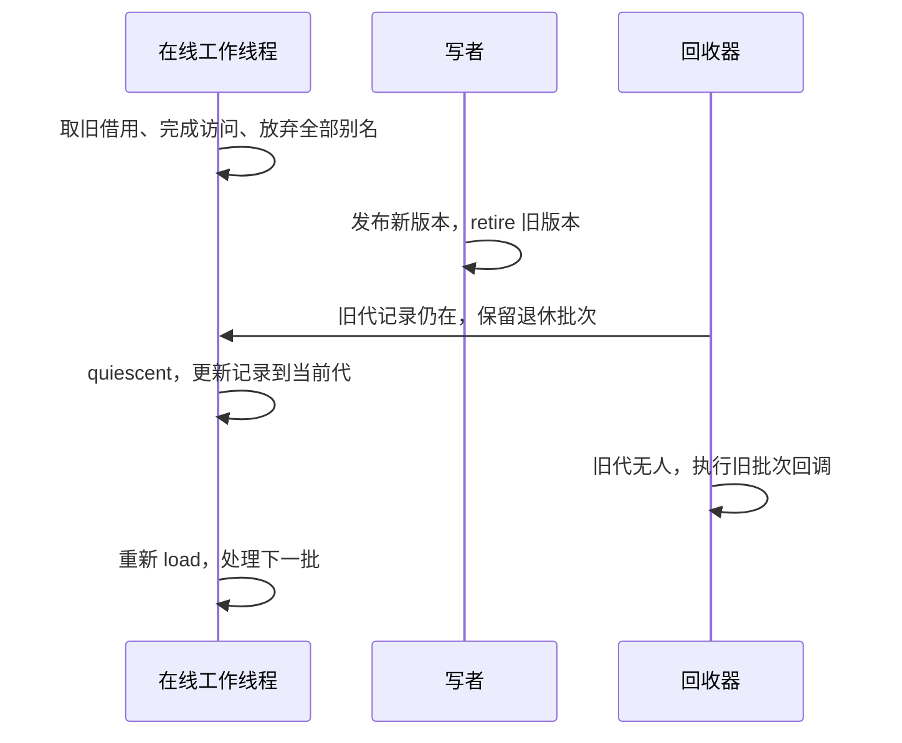

# QSBR：由应用亲自声明“不再持有旧借用”

EBR 在作用域退出时获得静默证据。事件循环或批处理线程往往已有更自然的边界：这一批请求结束，临时借用都已消失；接下来可以开始下一批。QSBR 把这个边界交给应用报告，而不是要求每次访问都创建 guard。

本篇对应 [qsbr_participant](../../exercises/include/concurrency_study/epoch.hpp) 与 [R2 reference](../../exercises/R2_qsbr/reference.hpp)。它与 EBR 共用分代状态，但应用义务不同。把两个类名换一下而不改变借用边界，会造成错误的保护承诺。

## 1. 上线不等于正在解引用，下线也不等于睡眠

participant 构造时在线，域记录该线程当前 generation。在线期间应用可以加载 SC 源并读取不可变对象。回收器只知道“自上次静默报告以来，这个线程可能还持有借用”，不知道某一条 C++ 解引用是否已经结束。因此读完一个对象但没有报告，仍然会阻止旧代的回收。

quiescent 的含义是：此前取得的所有借用都已停止使用，此后需要从共享源重新取得借用。它在元数据锁下把线程 generation 更新为当前域的 G，并通知等待者。这个操作可以不下线，线程可以继续服务下一批请求。

offline 的承诺更强：当前全部借用结束，离线期间不再从这个协议保护的源取得或使用借用。实现将它从读者表移除。重新调用 online 才能再次读取共享对象，而且必须重新加载源。操作系统调度器让线程睡眠、yield、等待网络或抢不到 CPU，都不会自动调用 offline，也不能证明线程没有保存指针。

## 2. 为什么报告必须与真正的借用结束一致

设工作线程持有 old，写者退休 old@1 并推进到 2。工作线程调用 quiescent，记录变为 2；回收器检查“不存在 <=1 的在线读者”，于是释放 old。如果工作线程随后还去读 old->field，就已经违反报告所承诺的事实。这里并不存在“库至少还应该多等一下”的补救：库唯一的证据来自应用，而应用提供了错误证据。

因此不能把裸指针藏在下一轮事件、异步闭包、缓存、成员变量里跨越 quiescent。复制出独立值可以，保存强所有权副本也可以，但那属于另一份明确的所有权机制。指针变量赋 nullptr 是教学中很直观的提示；真正条件是没有任何别名会继续使用，不能只清掉其中一个变量。

quiescent 与 retire 若并发，由同一元数据锁决定先后。若报告先发生，而对象后退休，该对象可能仍需等下一次报告，这是安全的保守等待；若退休先发生，报告就能跨过该退休代。应用不能仅以墙钟“我刚报告过”判断某个具体回调一定完成。

## 3. R2 让“已读完”和“已报告”在时间上分开

reference 的 worker 创建 participant、加载 42、把它复制到普通 int，再放弃 borrowed，通知主线程 entered。此时对象的解引用事实上结束，但 worker 故意没有报告静默。主线程固定做 64 次发布与退休，然后 collect：结果必须为 0，pending 为 64。

主线程开放 report 门闩，worker 执行 quiescent 后发出 reported 信号，再等待 leave。主线程收到 reported 后执行 collect，这一次应释放 64 份；工作线程此刻仍在线、仍未退出。最后主线程允许 worker offline 并退出，摘除最后的当前版本、barrier，累计删除 65 份。

这与 R1 的差别可直接观测：R1 必须结束最外层读区才能取得静默证据；R2 通过显式报告跨代，线程无需退出。两者都只退休 64 份带 int 载荷的观测对象，逻辑载荷上限为 64*sizeof(int)，另加当前版本、观测计数器引用、填充与回收元数据。这个有限批次是刻意的应用预算，防止“忘记报告”的演示变成耗尽内存实验。

实验里 worker 在 reported 后仍在线等待 leave，是为了验证“报告可释放旧代，而无须线程结束”。在实际事件循环中，长期阻塞前通常应 offline，否则阻塞之后新退休的对象又会被该在线记录拖住。不能把这个测试停顿照搬成推荐的长期等待布局。

## 4. 本教学 API 的确切约束

每个线程在同一域最多有一个在线 QSBR participant。禁止它与同域 EBR/RCU guard 混用；否则一次 quiescent 可能覆盖另一个仍在使用旧对象的读区。重复在线注册、在线时创建混合 guard、离线时 quiescent 都抛 logic_error。online/offline 自身是幂等的状态切换，重复 offline 不重复移除记录。

participant 不可复制或移动，创建与使用必须属于同一线程。析构自动 offline，正常线程退出不会留下 TLS 指针；强制结束线程不属于支持的退出方式。域必须长于 participant，且析构前排空回调。回收器不会自动发现应用藏起来的旧指针，也不能检测“刚才的 quiescent 是否撒谎”，这部分是客户端前置条件。

R2 还有两次需要传播异常的通知：进入读者状态的 entered，以及成功报告静默的 reported。二者都由 worker 持有；catch 给尚未满足的通知设置同一个 exception_ptr，再把异常交给 worker future。主线程用 get 等待通知，既能看到成功，也能看到对应阶段的原异常。主线程的 report 和 leave 是可重复放行的控制门，异常收尾必须先打开两道门，才能等待 worker；否则 worker 可能越过 report 后又卡在 leave。收束之后，仍发布的对象由主线程删除，已退休对象通过 barrier 回收。详见 [故障注入及自测答案](06-validation.md)。

在线 participant 调用该域 barrier/synchronize 会被拒绝，因为它可能在等待自己报告。若需要线程自己回收，应先结束全部借用并 offline，再 barrier，再 online。collect 可以在线调用，因为它不等待该读者退出；能否实际回收取决于它当前的代号，调用本身可能返回 0。

后台线程无关地停顿通常只拖住它直接涉及的工作；QSBR 在线线程忘记报告，却会拖住整个域中许多不相关对象。这是把证明责任放在应用循环边界上的代价。预算策略可以是每批最多 N 次退休、超过阈值停止发布并要求静默、合并中间快照，或者使用不同域隔离独立工作；域隔离必须同时正确隔离指针借用和退休，不能只为了缩短等待而换一个域删除对象。

## 5. 与 liburcu 的联系，及不能照抄的部分

liburcu 提供 QSBR 风格；其 [urcu-qsbr.h](https://github.com/urcu/userspace-rcu/blob/master/include/urcu/static/urcu-qsbr.h) 把 quiescent_state、thread_online、thread_offline 的状态和屏障放在一起阅读。它的读侧进入/退出和注册协议与本教学类并不相同，也不是把本版 mutex 删除就能获得的性能版本。

应从这一手源码学习“谁报告状态、报告前后的访问如何排序、等待者怎样获通知”。本版选择锁内单调 generation，证明在 [EBR 篇](03-epoch-reclamation.md) 中展开；它没有导入 liburcu 的 Linux 屏障、futex 或动态链接回调线程语义。源代码的具体优化更不能当成 C++23 任意平台的语言保证。

## 6. 自测与解析

**线程已经读完，为何第一轮仍不能回收？** 回收器没有程序语义分析能力，在线旧代记录仍是它的唯一证据。直到 quiescent/offline，它必须保守地认为还有旧借用。

**每循环末尾调用 quiescent 是否总正确？** 只有循环末尾确实结束全部旧借用才正确。若把指针留给下一批或异步任务，即使代码每次都调用，也是在错误地报告。

**offline 后能否用刚才保存的指针快速读一下？** 不能。offline 允许回收器忽略本线程，此时旧对象可能已经释放；重新上线后必须重新加载。

**为什么 QSBR 不是比 EBR 更高级的一步？** 它使用额外的应用结构信息换取不同的报告方式。没有可靠静默边界的任务、跨协程保存裸借用的任务，未必适合这种契约。

按 [验证说明](06-validation.md) 编译 R2 的 solution，预期输出 no report retains 64、quiescent releases 64 while online、total 65。runtime 还检查重复注册、混用域协议、offline 和再上线周期。
