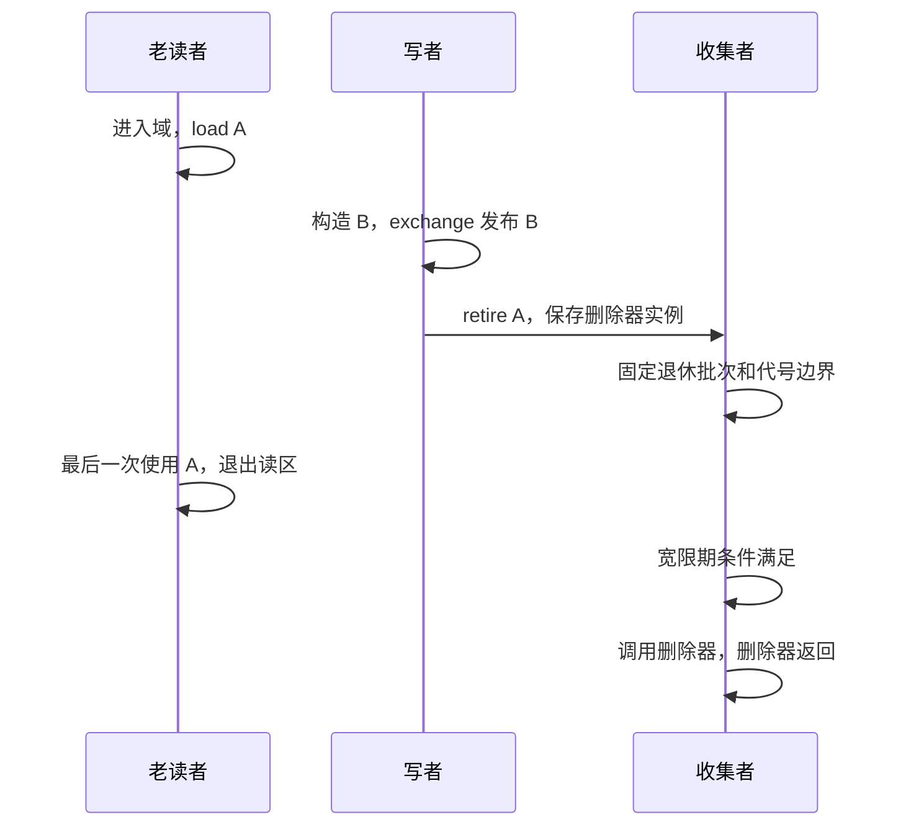

# RCU：版本发布、宽限期与回调完成是三个事件

如果共享对象是一份读多写少的配置，写者常常希望一次构造完整新版本，让读者始终读取自洽版本。RCU 把这类协作分成“发布新版本”和“在安全时处理旧版本”。本篇对应 [rcu.hpp](../../exercises/include/concurrency_study/rcu.hpp)、它使用的 [epoch.hpp](../../exercises/include/concurrency_study/epoch.hpp) 和 [I3 reference](../../exercises/I3_rcu/reference.hpp)。

RCU 是一种组织读者、更新者与延迟动作的方式。它不自动提供写者互斥，也不要求所有实现都采用相同的 epoch 算法。这里使用上一节的短锁分代核心，把读者退出、退休批次和回调结束的关系直接写出来。

## 1. 从可变对象切换到不可变版本

I3 的 config 包含 version、payload、checksum，构造时令 payload=3*version、checksum=4*version，此后字段都是 const。一个写者构造 fresh，通过 SC exchange 替换 current，得到 old，然后 `old->retire({}, domain)`。四个读者各做 2000 次读取，每次先创建 rcu_reader，再 load current，再验证 checksum==version+payload，最后离开读区。

为什么不原地改 payload、再改 checksum？因为生命期保护不提供字段互斥。读者可能与写者同时访问普通字段，形成数据竞争，而不只是“读到中间版本”。构造私有新版本再发布，才把多字段初始化作为完整快照交给读者。若数据本来需要原地更新，就要另行设计原子/锁协议，不能只套一个 RCU guard。

为什么 guard 必须先于 load？与 EBR 一样，先拿到 old 再登记读区会出现晚登记窗口。读区覆盖加载及所有解引用；离开之后若还要用结果，必须复制独立值或取得另一种受支持的所有权，不能把裸指针当返回值永久保存。

## 2. 生命周期拆成四个节点

发布是 source 的可达性变化。退休是转交延迟动作的所有权。宽限期结束说明相关老读区已经结束，允许处理旧版本。回调结束才说明析构、计数、关闭资源等用户动作实际完成。把这几个时刻合并成一句“换了指针就安全了”，会漏掉不同层次的同步要求。

I3 的单写者让应用更新顺序明确。多写者若各自完整构造独立版本，exchange 仍可给出替换顺序；但若它们需要“读取旧版本、在旧版本上增量修改”，就存在丢更新和旧指针借用的问题，需要写者锁、CAS 重试以及相应保护。这是更新协议，不是回收器能自动决定的语义。

## 3. 为什么宽限期要固定边界

本版 reader 表是域内 map，每个线程的最外层读区记录 generation，嵌套只增加深度。synchronize 在元数据锁下取得 cutoff 并递增 generation，等待所有 generation<=cutoff 的记录退出。新读者得到更大代号，因此即使一批新读者持续存在，也不会代替已经结束的旧读区延长等待。

旧实现把 TLS ReaderState 的裸地址放到全局 vector。线程退出后地址失效，下一次扫描会解引用已销毁对象；单单把 depth 改成 SC 也修不好这个所有权错误。新实现直接把记录作为 map 的值，在最外层 unlock 时删除。等待者从不在锁外持有记录指针，因此线程 ID 重用也不会让旧记录凭空复活。

如果仅不断读取某个线程的 depth 是否为零，线程退出后迅速重新进入可能让收集者一直看到非零，等到了本来不相关的新读区。generation 把“这一轮读区结束”和“这个线程以后仍在工作”区分开。域销毁仍必须等全部参与者和回收调用结束；移除 TLS 裸指针不等于域可以比读者先销毁。

## 4. 致命批次错误：先等宽限期，再取当前队列

考虑这种错误代码的逻辑：先 synchronize，返回后把“现在 pending 里的全部记录”拿来删除。在 synchronize 固定边界之后，可能有新读者进入，加载仍可达的 X；另一个写者随后摘除 X、retire X。这个新读区不在旧宽限期必须等待的集合里，但 X 已进入 pending。

若旧 synchronize 返回之后才取队列，就会把 X 也取进来，使用不属于它的宽限期回收。它与“源原子用了什么内存序”是两个独立问题；即使全部 SC，这个批次归属错误仍成立。

正确代码先在 pending 锁内把 batch 与后续退休分开，再建立不早于这一批退休的 cutoff，等待对应老读区，最后只执行 batch。新退休记录留在 pending，等下次收集。原有分代记录也让 collect 能逐条判断它们是否已经安全，不能借用另一个对象的判断结果。

runtime 的 late_retirement 在前一批回调已开始时建立新的读者与退休对象，检查新对象不会借前一批的宽限期释放。它覆盖一个明确的批次隔离场景；更窄的“synchronize 刚返回、取队列之前”的错误窗口依赖上述时序推导，有限测试不能枚举所有调度。

## 5. 并发 barrier 为什么还需要等待正在执行的回调

再考虑两个 barrier。A 取走批次并开始删除器，pending 已空；B 进入，若只检查 pending 就返回，可能漏掉 A 尚未结束的回调。B 的调用方据此销毁回调捕获的计数器或卸载代码，会与 A 继续执行的动作冲突。

本版 collector mutex 跨整个取批次、等待宽限期和执行回调阶段。B 必须先等 A 释放 collector，再拿自己的 batch。这样，B 到达前已被 A 取走的工作要么已经完成，要么 B 会等待它完成；B 前已退休但仍在 pending 的工作则会进入 B 的批次。与 B 并发的新退休可以被包含，也可以留待下一轮，取决于元数据锁下的批次切分。

pending() 返回的是 outstanding：队列中记录加上已取走但回调未结束的记录。计数在回调与其捕获状态销毁之后才减少。runtime 的 concurrent_barriers 用门闩把 A 固定在删除器内，启动 B，检查 B 没提前返回；开放门闩后，B 必须读到 A 回调写入的普通非原子值 17。这个值检查不仅验证删除次数，也验证完成同步的可用性。40 ms 的未完成采样有调度覆盖局限，不能当成形式证明；最终状态检查及 collector 锁推导共同支撑结论。

## 6. synchronize 与 barrier 的不同契约

在本版中，synchronize 只等待当前界定的一段老读区结束，绝不执行删除器。barrier 则等待先前退休的回调完成；有 batch 时它会内部等待宽限期，空 batch 时可直接返回。两者都不是“从此再无读者”的总开关，也不能替代停止生产和 join。

回调可以再次调用 retire，新增记录保存到 pending。但这次 barrier 已固定 batch，因此不承诺把回调中新产生的记录也排空。停止外部生产后，如果回调有有限的派生退休，可以循环 `while (domain.pending() != 0) domain.barrier();`；如果回调能无限创建新回调，就不存在有限结束的排空契约。I3 的删除器不派生退休，因此最后一次 barrier 足够。

回调期间没有持有 pending 元数据锁，但仍持有 collector。为避免自己等待自己，本版拒绝读区内对同域 synchronize/barrier；回收回调中任何 epoch/RCU 阻塞等待也被拒绝。回调中 collect 返回 0。删除器可以获取别的应用锁，但调用者必须保证没有“读者拿着该锁等 barrier、回调等该锁”的环。安全回收协议不是通用死锁消除器。

## 7. 容量、进展与资源边界

I3 每 16 次更新执行 barrier，所以单写者的退休积压最多 16 份 config，另有当前版本和临时构造的新版本。计量载荷可用 16*sizeof(config)，实际堆占用还含记录/分配开销。barrier 等待长读者期间不会继续发布，这就是本例的写侧背压；不能一边取消这个等待一边保留“积压最多 16”这一结论。

读侧包含 map 登记、锁、可能的分配以及 SC 源读取。本教学实现没有“几乎零开销读侧”的承诺。collect 的扫描按退休记录和活动读者组合检查，barrier 则可能被最慢相关读区、另一个收集者、用户回调及调度拖住。整套操作不保证 lock-free、wait-free 或有固定延迟。

局部域彼此独立，默认域也是同一类型的静态实例。每个对象必须在保护它的同一个域退休，域与删除器捕获状态都要活到回调完成。retire/回调内部异常采用终止契约；guard 登记失败可抛异常，阻塞等待检测到自等待抛 logic_error。generation 或嵌套深度溢出终止。正常退出通过 RAII 清理注册；强制结束线程、域析构与调用并发、跨线程销毁 guard 不受支持。

I3 的读者没有等待主线程放行的门闩，有限循环可以自行结束；但写者构造新配置或启动更多线程失败时，仍须先收束已有读者，再收回当前配置并排空退休队列。reference 的 finish 在正常和异常路径共用，未发布配置用 unique_ptr 管理；catch 完成清理后重抛原异常。runtime 的并发 barrier、晚退休与长读者测试另外有控制门闩，已统一为先打开全部门、再等待全部 worker。回调开始通知由回调及收集 worker 持有，若收集者在调用回调前失败，主线程也会收到原异常，而不是无限等待回调发信号。完整检查见 [P2 返修验证记录](06-validation.md)。

## 8. 标准与工业实现的阅读边界

固定标准基准是 [N5050](https://www.open-std.org/jtc1/sc22/wg21/docs/papers/2026/n5050.pdf) 的 `[saferecl.rcu]`，尤其 domain.func 中对 synchronize、barrier 和非侵入式 retire 的区分。标准 API 相似不意味着 cs 是替代实现：本版增加 pending/collect、公开构造独立教学域、采用更强的客户端 SC 限制，并改变部分异常契约。标准自由函数 rcu_retire 可报告分配/删除器构造异常，本版统一 noexcept；标准等待函数 noexcept，本版可用 logic_error 报告非法自等待。不要仅替换命名空间就宣称迁移完成。

liburcu 的 [官方 API 文档](https://github.com/urcu/userspace-rcu/blob/master/doc/rcu-api.md) 区分线程注册/注销、等待既有读区与等待 call_rcu 回调完成，也讨论回调线程限制。这是理解工业退出协议的依据；本版没有后台 call_rcu 线程，回调直接由 collect/barrier 的调用线程执行。库的快路径实现与平台屏障不能当成本版的进展证据。

## 9. 自测与答案

**旧读者退出后，delete 是否一定已完成？** 不一定。退出只满足潜在宽限期条件，回调可能尚在 pending 或尚未执行完；需要 barrier 的完成契约。

**barrier B 看到 pending 为空，能否返回？** 仅看容器不能判断。还要覆盖其他收集者已经取走的在途回调，本版用 collector 串行锁完成这一点。

**新读者为什么可能不必等待？** 在边界之后登记的读者从合法源加载无法得到这一批已摘除对象；其代号大于 cutoff。若读者绕过源从缓存拿旧指针，这个论证就失效。

**同线程内层 guard 析构后，外层借用还受保护吗？** 是，深度只减一，最外层退出前代号不变。runtime 直接检查内层退出后的 collect 仍返回 0。

**怎样复现？** 按 [验证说明](06-validation.md) 运行 I3 的 solution 及 reclamation_test。普通示例必须检查 8000/8000 次读取和 65 次析构，不能用“至少读对过一次”作为验收。
