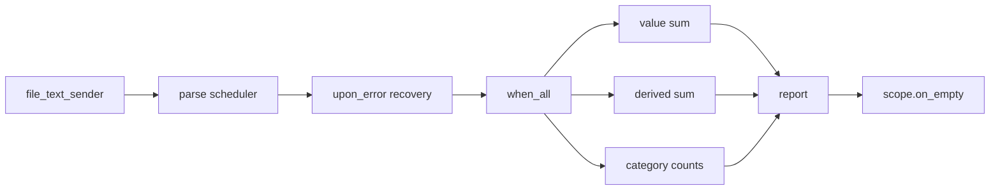

# 13. Record pipeline project

本项目把 I/O completion 放进一个小型记录流水线。输入是 bounded regular file，每行：

```text
name,category,value
```

C05 主讲字节格式、编码和 schema。本章只保留三列，让重点落在 execution 图、资源归属和失败边界。

## 场景

我们要处理一个小文件，得到四类结果：有效记录数、非法记录数、`value` 总和、`value * 2` 总和，以及按 `category` 分组计数。文件读取必须是 native completion 后端发出的 sender stage；不能先阻塞等完 I/O，再把文本交给一个看起来像 execution 的图。

公开边界：文件必须是 regular file，大小不超过 1 MiB；记录数不超过 4096；单行 `value` 限制在本练习范围内，并用 `int64_t` 累计。非法记录只增加 `invalid`，不终止整条流水线。

## 图结构

状态机按阶段推进：



`file_text_sender` 持有一个 resource lease：`io_context`、已打开文件、buffer。这个 lease 由 `run_pipeline` 局部对象持有到 `sync_wait(graph)` 和 `scope.on_empty()` 之后。completion 回调可以在 IOCP 或 io_uring worker 上运行，但最后一个 `io_context` 引用不会在 worker 里析构；否则 worker 可能在自己的线程里 `join()` 自己。

图中保留两个 scheduler：parse scheduler 运行解析和 category 分支，compute scheduler 运行 value 与 derived 分支。三个计算分支通过 `when_all` 合流。`async_scope` 包住已接受的计算工作，函数返回前等待 `scope.on_empty()`，然后销毁 context、文件、buffer 和 scheduler。

## 关键代码形状

读取 stage 的责任是把 native completion 映射成 sender 信号：

```cpp
auto graph = file_text_sender{path, file_resources}
  | stdexec::let_value([&](std::string text) {
      return stdexec::schedule(parse_pool.get_scheduler())
        | stdexec::then([text = std::move(text)] { return parse_records(text); })
        | stdexec::upon_error([](std::exception_ptr) noexcept {
            return parsed_batch{{}, 1};
          });
    })
  | stdexec::let_value([&](parsed_batch batch) {
      return scope.nest(stdexec::when_all(value_sum, derived_sum, category_counts));
    });
```

这段代码的重点不是语法，而是边界：I/O stage 完成后才产生 `std::string`；parse stage 的异常只在局部恢复；compute stage 不共享可变结果；drain stage 在所有已接受工作完成后再释放资源。

## 失败传播

打开文件失败、submit 失败、短读、文件并发截断，都通过 `set_error(std::exception_ptr)` 进入图。parse 阶段的格式错误不是异常，而是局部 `invalid` 统计。只有真正的解析异常，例如超过 4096 行，才进入 `upon_error`，并转成一个带 invalid 统计的空 batch。

取消和停止不伪造成错误。read sender 如果看到 receiver environment 的 stop token 已经请求停止，直接 `set_stopped`，不提交系统请求。提交后发生取消时，最终信号由真实 completion 决定：目标 I/O 已完成就返回 value，系统确认取消才返回 stopped。

## Part 解析

Part 1：把 native read 封成 sender stage。`connect` 建立 operation state 和 stop callback；`start` 只提交系统请求，提交后不再访问可能被 receiver 销毁的 operation state。

Part 2：解析记录。空行忽略，坏行计入 invalid。`name` 和 `category` 不能为空，`value` 必须完整解析，范围外数值拒绝。

Part 3：构造三条并行分支。每条分支只读不可变 records，分别计算 value sum、derived sum、category counts。`when_all` 的返回值是合流点，不是共享写入点。

Part 4：scope 收束。`sync_wait(graph)` 只说明 graph 的终结信号已到；`scope.on_empty()` 说明 scope 内接受的工作都离开。之后才增加 drain 计数并返回 report。

阶段计数来自实际 lambda 执行，不是预填常量。checker 只要求 lower bound：parse/recovery 路径跑过、三条 compute 分支跑过、drain 跑过、环境查询位置被记录。计数用于证明图经过这些位置，不声称性能收益。

## Environment and capacity checks

`env_queries` 来自 read sender 的真实 query 点：`start()` 先调用 `get_env(receiver)`，再调用 `get_stop_token(env)`，然后才决定是否提交 native read。checker 用 `write_env` 注入一个已经请求停止的 `inplace_stop_token`，要求 pipeline 以 `pipeline_stopped` 结束，证明停止信号来自 receiver environment，而不是普通 lambda 里的预填计数。

P1 的容量边界也进入 driver：稀疏文件超过 1 MiB 必须在打开/读取阶段拒绝；超过 4096 条记录必须抛出 `capacity_error`；单行数值超过本练习范围必须抛出 `capacity_error`。普通格式坏行仍然只增加 `invalid`，不会和容量拒绝混在一起。

## Sanitizer-friendly graph shape

GCC 13 + ASan 会触发当前 stdexec 快照在嵌套 `let_value` 返回不同 scheduler domain sender 时的 completion-signature constexpr 诊断。P1 因此采用两段 graph：第一段是 `file_text_sender -> continues_on(parse_scheduler) -> then(parse_records) -> upon_error`，这一段证明 native read completion 进入 parse/recovery sender 图；第二段把得到的 batch 交给 `when_all` 三个 scheduler 分支并用 scope 收束。这个拆分不是回到同步 helper：文件读取仍由 sender 提交、完成、查询 stop token 并传给 parse stage。
