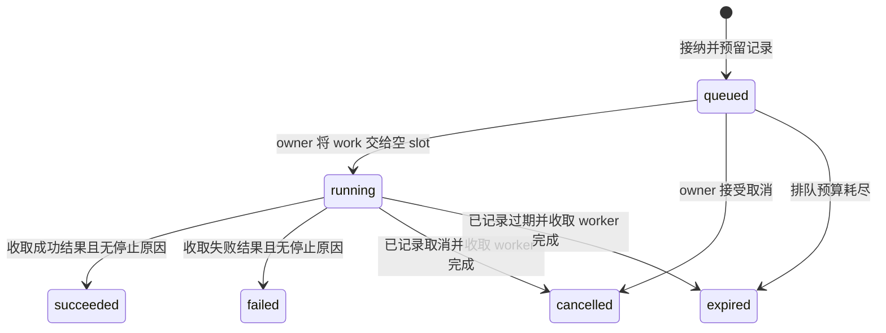

# 11 把协议、工作和关闭接成一个有界服务

先读 L05 状态策略与第 5、7、10 章。项目 [P1 HTTP/WS](../exercises/P1_task_service/README.md)和 [P2 gRPC](../exercises/P2_grpc/README.md)共享 task_registry/task_runtime 代码，但运行在独立实例，各有自己的 ID、任务和幂等记录。不能跨两个进程查询同一 task ID。

## 1. 先定义接受的工作

任务是 `left + right` 的有界模拟作业：输入整数各在 ±1,000,000，steps 为 0—1000，每步模拟 1 ms 工作，预算为 1—60000 ms。steps 用来观察排队、进度和取消，不宣称代表 CPU benchmark。结果用 int64 保存。

提交者提供 1—64 字符的幂等键，允许 ASCII 字母、数字、点、下划线和短横线。服务返回 task ID 与 snapshot。一个 snapshot 包含 phase、可选 result、progress、revision 和 stop_requested。结果只有 succeeded 时有效，不能把默认数值 0 当作“尚未完成”的替代编码。

硬边界是 2 workers、128 live、1024 records、32 watches、每 watch 8 events。HTTP/native 连接最多 16；HTTP header 8 KiB/body 4 KiB、WS/gRPC 单消息 4 KiB。gRPC transport 另设每连接 16 streams 与 resource quota；这不是整个 gRPC 进程严格 64 MiB RSS 承诺，库和内核有自己的分配。

## 2. 状态转移及其线性化位置

所有 registry 操作都由 owner 串行执行，这给提交、取消、到期与完成建立可解释的顺序。worker 只读取 spec/stop、更新原子 progress、写 completion slot。提交在 records.push_back 成功并增加 live 后才成为接纳；失败分配不应返回任务身份。终态一旦形成便不回到 running。

running 取消先写 stop_reason 和 stop_requested，发 stop_source，但保留 running phase 和 live 计数。收到 worker 完成时 task_policy::finish 优先保留已记录原因，而非用加法结果覆盖 cancelled/expired。若取消与预算同时到达，tick 先处理已过 deadline；后来的取消不能改写第一次原因。若完成早于 deadline 被 owner 观察，可成功；物理计算结束但 owner 迟迟未收取时，课程契约按 owner 观察到期裁定。

这个选择必须写进契约，因为“实际计算在 deadline 前结束”若没有可靠时间戳，owner 无法从一个后来到达的整数结果推断它。需要这种精确语义时应让 completion 带受信单调时间戳并重写裁决规则，不能靠测试恰好运行得快。

## 3. 从单表基线到异步工作

L05 先用手动 start_next/finish 驱动 registry，建立可确定的正确状态模型。随后 L06 把相同操作接到两个固定 slot 和 jthread，P1/P2 再接到真实协议。每层只增加一类责任：策略 → 调度/交接 → 协议适配。HTTP status 和 gRPC Status 的差异在适配层，不复制一份不同的接纳算法。

查找最多扫描 1024 records，属于有界 O(n) 基线。没有性能证据时不添加多索引、分片锁或持久队列。将来测得查找占主导再增加索引时，要一起维护 key/id 索引、TTL 删除、分配失败和引用失效，不只比较查询那一行的复杂度。

## 4. 观察通道的正确性

subscribe 在同一 owner 操作里读取当前 snapshot 并加入 watch。发布先增加 revision，再把快照加入对应队列；进度只在观测到增长时发布，因此不承诺每个 worker 步骤都有一个事件。队列满后清空并标 overflow，next_event 返回 slow_consumer 并移除订阅。

终态事件取出后自动移除 watch。P1 session 析构/强关还会 unsubscribe；P2 用 shared atomic alive，在调用作用域结束后由 registry.tick 回收。这解决“为取消清理再 post 一次，但 post 本身失败”的遗留订阅问题。alive 仅传达是否仍需要观察，不发布其他非原子数据。

客户端重连不使用旧 revision 请求重放；应 GET 当前状态并新建 watch。若需要全量事件历史，需独立持久日志和恢复游标，本项目没有悄悄用一个无限 deque 代替。

## 5. 关闭是一个协议

关闭入口先停止接受连接/新任务，保留查询已有状态的能力；engine.begin_drain 继续调度已接纳 queued 工作。5 秒内等待 live 归零、发送终态、关闭会话、取消 timer、join workers。超时则请求取消任务并强关网络，最终仍等待本地线程归还资源，同时设置 deadline_exceeded。预算超限不会因为最后成功 join 而变成 clean。

关闭标志不能替代对象存活。session handler 捕获 self，所以 socket close 后迟到 handler 仍有有效对象；server 只弱引用 sessions，避免环。on_drained 回调在调用前从成员移出，避免回调触发析构后继续访问原成员。测试的 cleanup guard 在异常路径也释放 gate、请求停止并 join。

P1.clean 还检查 lost_responses 与 cleanup_failed；engine.failure 保存执行失败。只判断 io.run 返回会漏掉“工作已经丢失，所以自然没有待办”的假成功。L04 的 RST 检查和 L06 的关闭检查分别覆盖这个原则在连接和任务层的应用。

## 6. 观测、诊断与故障定位

/metrics 输出 accepted、duplicates、rejected、terminal、live、running、connections。accepted 只计新接纳，duplicates 不增加新工作，terminal 包括成功、失败、取消、过期。测试将这些计数与实际两次接纳、一次重复历史对应，防止监控只是预填字符串。

诊断日志应包含 request/attempt ID、task ID、连接身份、阶段、时间、错误类与关闭原因，避免将幂等键、完整 body 或证书私钥默认记录。metrics 标签选择有限枚举；task ID、任意路径和 key 属于高基数字段，应进入日志/trace，不能无限创建时间序列。trace 区分 pool wait、connect、TLS、request parse、queue、execute、response write，传播不受信 trace 元数据也应限制长度。

本课提供实际计数与分阶段 benchmark，没有接入远端 telemetry collector。故障处理按范围进行：坏帧关连接，单任务失败保留结果，慢订阅关闭观察通道，owner runtime 失败停止接纳并收束。对照“accepted 增加、live 不下降、worker slot 无完成”优先查交接；对照“terminal 已增、客户端仍超时”优先查响应写/传输，而不是重复执行任务。

## 7. 项目自测与解析

1. **运行中取消后为什么 phase 仍 running？** worker 仍占物理执行能力；stop_requested 描述意图，终态要等待完成 ACK。
2. **1024 records 满了但 live=0 能否无限接纳？** 不能，保留窗口内幂等记录仍占容量；可等 TTL 到期，不应提前悄悄删记录。
3. **相同 key 重试时服务满载怎么办？** 先返回已有任务；只有新任务消耗接纳额度。
4. **异常时直接 io.stop 然后宣称优雅退出对吗？** 不对，停止分发可能留下未收取操作；它只能是记录失败的紧急路径，clean 必须失败。
5. **HTTP 和 gRPC 数据是否自动互通？** 共享代码不共享进程内状态；跨实例持久共享是 C12 后续集成问题。
