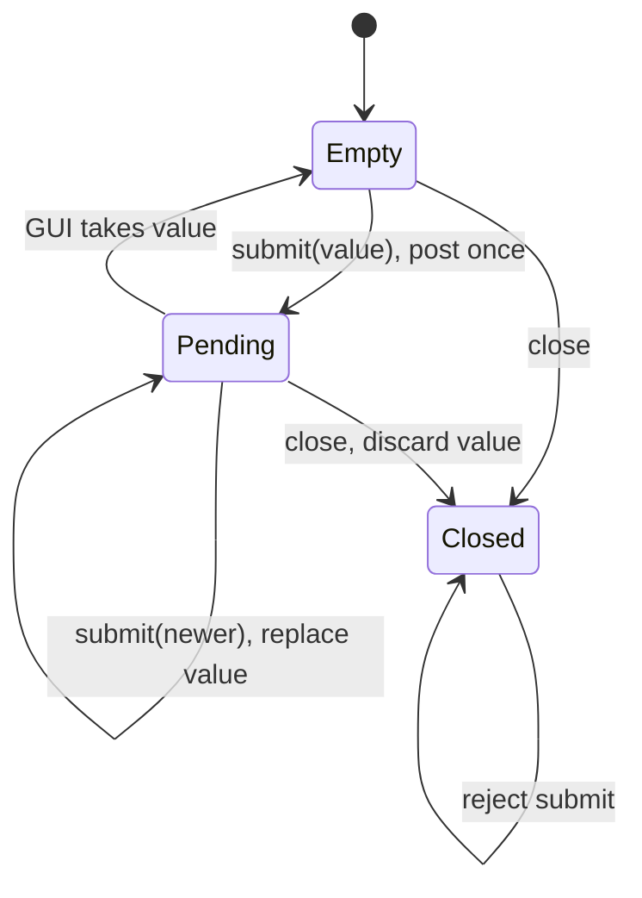

# L15 从事件积压定位 UI 响应性

MediaWorkbench 的后台分析每完成一块样本，就能生成一个新的波形预览。把计算移到 worker 后，窗口仍可能很忙：主线程不断接收旧的预览通知，虽然用户只需要最新一张。这里要先回答一个语义问题，再谈性能：**中间结果是否必须逐项交付？**

本章需要 [L03 的 queued 连接](03-metaobject-connections.md)、[L05 的线程收束](05-worker-cancellation-lifetime.md) 和 [L11 的波形归约](11-audio-processing.md)。测量方法由 [C13](../../C13_Performance_Numerics_Data_Layout/README.md) 主讲；这里把阶段定位落实到真实 Qt 事件队列。

## 1. 先固定可以比较的契约

输入是一位生产者计算出的有限预览序列 `v0 ... vN-1`。GUI 对当前请求只承诺：处理完已接受的输入后，显示值是最后一次提交的值；关闭后不再更新；回调运行在主线程。本实验没有逐项交付承诺。

这与媒体 sample 数据队列不同。丢失一块 PCM 可能造成声音不连续；丢失一条审计记录可能破坏系统语义。不能用本章的 latest-value mailbox 替代 [L10 的有界数据管线](10-bounded-pipeline.md)。同样，来自不同请求的预览要先通过 generation 检查，本章只隔离一个当前请求中的通知成本。

为什么必须先写这些条件？如果初版承诺每一条消息都执行，而新版只交最后一条，减少耗时只说明它少做了工作，不能称为同契约优化。本实验从一开始允许覆盖过时预览；两个版本都计算全部输入，区别只在 GUI 通知与赋值的次数。

## 2. 正确基线：每个预览一次 MetaCall

完整基线在 [per_event.cpp](../exercises/L15_responsiveness/per_event.cpp)。生产者是一个有限 `std::jthread`，每个输入计算同一个确定性值，然后向主线程 QObject 投递一次 functor：

```cpp
QMetaObject::invokeMethod(&receiver, [&, value] {
    final_value = value;
    ++applied;
}, Qt::QueuedConnection);
```

先让主线程暂时不排空事件，等待生产者结束，再显式处理属于 receiver 的 MetaCall。这不是正常应用的长期运行方式，而是为了隔离成本的受控负载：相同输入下，可以精确知道积压了多少条通知。

基线必须同时检查三件事：生产者提交完、主线程尚未排空时 `applied == 0`；排空后回调数为 N；最后的值等于对输入 N−1 独立计算的预期。少了最后一项，“什么都不更新”也可能被误当成快速实现。

从课程根目录运行：

```powershell
cmake -S exercises/L15_responsiveness -B build/l15 -G "NMake Makefiles" -DCMAKE_DEPENDS_USE_COMPILER=FALSE -DCMAKE_BUILD_TYPE=Release -DCMAKE_PREFIX_PATH="D:/Qt/6.9.2/6.9.2/msvc2022_64"
cmake --build build/l15
python tools/run_check.py --timeout 30 -- build/l15/c16_l15_per_event.exe 30000
```

直接运行前按构建说明设置当前进程 Qt `bin` PATH。输入上限为 100000，零、负数、尾随字符和超范围值会被拒绝。默认短 CTest 使用 1000 条输入；实验不会无限堆积事件。

## 3. 观察什么才能定位原因

程序输出一行 JSON，包含提交数、回调数、受控阶段的峰值待处理数、最终值，以及 `post_ns` 和 `drain_ns`。

| 字段 | 精确区间或含义 |
|---|---|
| `post_ns` | 启动生产线程、计算所有预览、提交通知、生产线程 join；不包含 Qt 应用初始化 |
| `drain_ns` | 主线程处理本对象全部 MetaCall 回调；不包含随后正确性断言和打印 |
| `callbacks` | 实际执行的应用预览回调数，不是绘制帧数 |
| `peak_pending` | 仅在“生产期间主线程不处理事件”的受控协议中确定的通知峰值 |
| `final` | 与独立输入公式核对的最终预览值 |

`QElapsedTimer` 给出单调时间，字段使用纳秒单位；单位不表示每一纳秒都可被物理时钟分辨。一次非常短的回调可能接近计时粒度，不能拿这种单次数字计算普遍加速比。

单看总时间下降，只能说明这个负载整体更快。若基线有 N 个实际回调、新版本只有 1 个，且变化主要出现在 drain 阶段，才支持“本负载减少了应用通知/赋值成本”的解释。它仍没有测量真实波形绘制、音视频解码、显示合成或用户感知延迟，也没有证明 cache miss 或系统调度是瓶颈。

Qt 的 `QWidget::update()` 本来就可以合并重绘请求。这里测量的是它前面仍可能逐条执行的应用回调，不能把回调数说成屏幕实际绘制了同样多次。

## 4. 从已有证据推导一个通知槽

既然当前契约只需要最新预览，可以把“值”和“唤醒通知”分开保存：

1. 每次提交覆盖 `latest`。
2. 没有 pending 通知时，才向 QObject 投递一个 MetaCall。
3. GUI 消费时取走最新值并清除 pending；释放锁后调用应用代码。
4. 新输入若恰好在本次消费后到达，可以再投递下一次通知。

状态足够小：一个可选最新值、一个 pending 标志、一个 closed 标志，以及保护这些状态的互斥量。这里无需通用执行器或无锁队列。



Reference 在 [reference/solution.hpp](../exercises/L15_responsiveness/reference/solution.hpp)。观察它把客户端 `apply` 放在锁外：`apply` 可能再次调用 `submit`；锁内调用会把一个合法重入变成死锁。清除 pending 和取走 latest 则必须在同一个锁保护区间，否则生产者可能看见相互矛盾的状态而丢失最后一次通知。

pending 表示尚未开始消费的通知，不包括正在执行的回调。消费过程中生产者可以再提交，因此“最多一个 pending”不等于“整个程序永远只执行一次回调”。在本章固定的生产后排空场景中，所有提交才会合并成恰好一次交付。

## 5. 生命周期和关闭仍需要独立约束

`PreviewMailbox` 本身是 QObject，投递的 functor 以它为 context。销毁该对象会使未处理的投递失效；没有必要让一个外部 receiver 的长寿命掩盖 mailbox 已经销毁的事实。

但 context 不能让正在调用 `submit()` 的生产者安全访问已析构的对象。调用者必须先停止并 join 生产者，再销毁 mailbox。`close()` 只使后续 UI 交付被抑制并拒绝新输入，不负责替你终止生产线程；线程责任仍按照 L05 收束。

约定只有一个生产者，GUI 消费和销毁在对象所属线程；`apply` 非空、不向 Qt 事件分发栈抛异常。Reference 用互斥量维护状态，独立 good 用原子值和通知位实现同一声明契约。不要从两个短实现都通过检查推断所有多生产者、任意跨线程析构或异常回调也已受支持。

## 6. 实现练习与完整解析

只编辑 [student/solution.hpp](../exercises/L15_responsiveness/student/solution.hpp)。已提供 QObject 环境、受控生产者、输入公式与检查器。Student 初始拒绝输入，因此会明确失败。

| Part | 学生工作 | 检查真正观察的行为 |
|---|---|---|
| A 最新值与通知分离 | 保存可覆盖的最新值，避免每次 submit 都 post | 128 次提交在主线程排空前只创建一次通知，最终显示 128 |
| B 发布与回调位置 | 用 queued 投递回主线程，保护共享状态 | 主线程未排空时没有回调；回调发生于 application 线程 |
| C 关闭与寿命 | close 幂等，抑制 pending 回调，销毁前保证生产者结束 | close 后再 submit 被拒绝，未消费对象销毁后不调用旧 callback |
| D 合法重入 | 客户端代码在锁外调用 | 第一次 callback 中 submit(2)，最终交付序列为 1、2，无死锁 |

A 的常见错误是把首次输入按值捕获到唯一的 functor 中。通知确实减少了，但所有后续值都被丢掉，显示永远停在第一次输入。独立 bad 就实现这个真实错误，检查器必须以 `latest preview survives coalescing` 拒绝它。

B 不能通过在 worker 直接调用 `apply` 解决。那样也许最终数字正确，却违反 GUI 执行位置。检查器分别验证内容与线程，不能拿其中一项代替另一项。

C 中“把指针设为 nullptr”不会取消 Qt 队列里的捕获。以 mailbox 自身作为 context 解决已投递回调的寿命；先 join 解决仍在进行的成员调用寿命；generation 则解决另一请求的语义身份。这三个问题不能只靠一个 QPointer 概括。

D 的正确顺序是锁内取状态、锁外调用。Reference 的 `std::exchange(latest_, std::nullopt)` 表明这次消费拿走了哪一份值；后续 submit 可以安全建立新的 pending 通知。

```powershell
ctest --test-dir build/l15 --output-on-failure
python tools/run_check.py --timeout 30 -- build/l15/c16_l15_student.exe
```

默认检查包括 Reference、独立 good、bad 拒绝和两个观察入口。Student 的初始失败是作业尚未实现，不属于能力缺失或 SKIP。

## 7. 原实验复验与独立采样

先让上述正确性检查全部符合预期，再比较 [coalesced.cpp](../exercises/L15_responsiveness/coalesced.cpp) 与原始 `per_event.cpp`。两者使用相同输入公式、工作量、生产者角色、生产后排空协议及计时边界。计时版本也保留最终结果和计数检查，检查失败的样本不进入有效汇总。

```powershell
python tools/run_responsiveness.py --bin-dir build/l15 --output build/l15-measurement-01 --interference-note "其他构建已停止；其他机器活动未完全观测"
```

每个版本、每个规模先单独启动一次预热，再独立启动五个采样进程。规模为 1000 与 30000；固定随机种子决定每轮版本顺序。脚本保存全部进程输出、失败、原始样本、中位数、范围、离散程度和源码/二进制前后指纹，不覆盖已有输出目录。

先解释成本转移：合并版本给每次 submit 增加了共享槽状态管理，但减少了 Qt 事件对象、通知与 GUI 回调。小负载或生产者与消费者持续交错时，收益可能不同；本实验刻意制造的整批积压不能代表所有交互负载。若 post 阶段增加、drain 阶段减少，应把两段一起报告，而不是只选择有利一段。

如果新版总成本没有改善，保留结果并说明当前负载不支持性能收益；有界通知数量本身仍是可以独立验证的资源性质。不要从这一个实验断言无锁、GPU、协程或任何尚未评估方案更好或更差。

## 8. 回到工作台

实际应用应先用时间戳或阶段计数区分读取、解码、分析、通知和绘制，再判断本章策略是否对应它的瓶颈。对只能显示最新状态的波形预览，可以采用有界通知；对必须逐项处理的音频数据，使用 L10 的容量与流量协议；对换源后的旧任务，先用 L05 的 generation 规则拒绝。

结论的边界始终来自证据：本章证明最新值交付和有界通知的契约，并给出可复现的事件队列成本实验。它没有替其他章节完成真实解码、真实窗口或物理设备延迟的验证。
