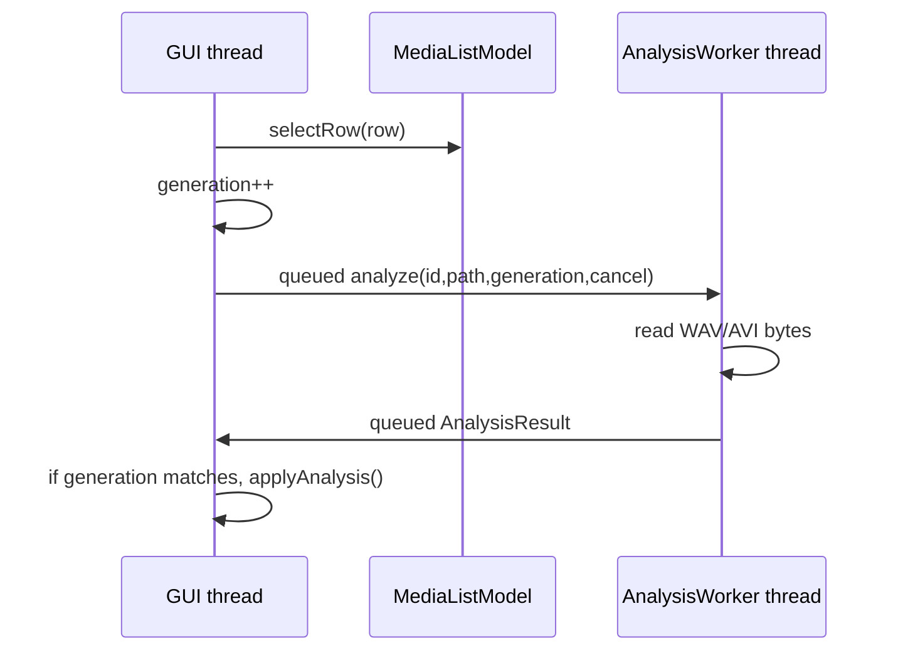

# 16 MediaWorkbench 综合项目

这一章把前面几条线接成一个可交互工具：本地媒体列表、过滤、选择、异步分析、波形预览、视频预览、播放控制、时间标记、会话保存恢复和安全退出。它不是播放器外壳。它要处理换源、迟到分析结果、坏文件、窗口关闭和无设备自动检查这些桌面程序每天会遇到的小事故。

项目入口在 `exercises/P1_media_workbench`。主应用 target 是 `c16_workbench`，四变体练习 target 是 `c16_p1_reference`、`c16_p1_good`、`c16_p1_bad_rejected` 和未默认运行的 `c16_p1_student`。

## 1. 目标和边界

MediaWorkbench 只读本地媒体，不下载、不写媒体文件。自动检查使用 `tools/make_media_fixtures.py` 生成的两个夹具：

- `c16_pulse_mono_48k_s16.wav`：1 秒、48 kHz、mono、PCM16。
- `c16_rgb24_pcm_1s.avi`：1 秒、64x48、RGB24、10 fps，带 PCM 音频。

应用可从文件对话框选择用户媒体；smoke 只使用 build 目录里的夹具。会话保存用 `QSaveFile` 写 JSON，失败时保留错误状态，不半写覆盖旧文件。

自动检查验证的是：模型导入/过滤/选择、WAV 真实字节分析、AVI 真实 Qt 媒体解码信号、标记、保存恢复、换源 generation、关闭收束和窗口 grab。它不证明扬声器真的发声，也不证明每台机器的硬件视频路径一致；这些属于设备和部署边界。

## 2. 最小接口

项目用四个核心类型：

```cpp
struct MediaItem {
    QString id;
    QString path;
    QString displayName;
    QString error;
    qint64 durationMs;
    double peak;
    QVector<float> waveform;
};

class MediaListModel : public QAbstractListModel { ... };
class AnalysisWorker : public QObject { ... };
class SessionController : public QObject { ... };
```

`MediaItem::id` 是从绝对路径 hash 得到的稳定 ID。视图可以过滤和重排，所以 selection 不能靠当前 row 持久化。会话 JSON 保存 ID、路径、当前选择、过滤文本和 markers；恢复时先完整验证 version、路径、selected、markers 和 1 MiB 大小上限，再原子替换旧状态。空项目是合法 session；引用丢失文件或坏 marker 时恢复失败且旧状态不变。

`MediaListModel` 只在 GUI 线程修改。它公开角色：`mediaId`、`path`、`displayName`、`error`、`durationMs`、`peak`、`selected`、`row`。Quick 章节会复用同一模型，所以这些角色既服务 Widgets 也服务 QML。

`SessionController` 是应用状态入口。Widgets 按钮、Quick 控件和 smoke 都调用它，而不是各写一套业务逻辑。

## 3. 异步分析流程

分析流程如下：



WAV 分析不是常量假数据。实现读取 RIFF/WAVE chunk，要求 `fmt ` 长度至少 16、PCM16 mono、data chunk 字节数为偶数，并按 data chunk 边界计算 duration、peak 和 64 桶 waveform。AVI 分析也不是逐字节扫文件名或固定 `peak=1.0`：它限定文件大小，递归解析 RIFF/LIST，进入 `hdrl/strl` 找到 audio `strh/strf`，拒绝缺失格式而不是猜 48 kHz；进入 `movi` 后消费真实 `00db` 视频块和 `01wb` PCM 音频块，并用全局 sample index 映射 waveform，避免每个音频块把整段时间轴重新折叠到 64 桶。真实播放和视频/audio buffer 观察仍交给 `QMediaPlayer`。

换源时 controller 设置旧请求的 cancel flag，并创建新的 cancel token 和 generation。worker 即使晚到，主线程也会比较 result generation；旧结果被丢弃。关闭时先 stop player，再让 worker 线程 `quit/wait`，析构不留下飞行回调。

## 4. 播放和预览

Widgets 主线使用：

```cpp
QMediaPlayer player;
QAudioOutput audio;
QVideoWidget video;

player.setAudioOutput(&audio);
player.setVideoOutput(&video);
```

预览窗口来自 `QVideoWidget`。自动检查通过 `video.videoSink()` 连接 `videoFrameChanged`，证明 Qt 解码路径至少交付了有效视频帧。音频观察用 `QAudioBufferOutput`。它依赖 FFmpeg 后端，表示“解码 buffer 到达应用”，不表示物理扬声器已经发声。没有音频设备时，buffer 到达仍是有效解码证据；设备输出要另测。

`--self-check` 会选择 AVI，调用 `play()`，等待音频 buffer 和视频 frame 都到达，再暂停。外层 `run_check.py` 提供进程超时，所以媒体后端卡住会变成失败。

## 5. 错误和资源上限

错误不抛到 GUI 事件循环外。分析 worker 捕获异常，放进 `AnalysisResult::error`，主线程应用到模型角色和 controller error text。当前教学实现限制：

- 只完整分析 PCM16 mono WAV，以及本课夹具使用的 RGB/PCM AVI。
- 文件读取有 8 MB 上限，chunk size、data 边界和截断输入都会报错。
- waveform 固定 64 桶，避免把整段音频缓存进模型。
- smoke 使用 1 秒夹具，并临时生成 24 kHz WAV、带额外 RIFF chunk 的 WAV、同 PCM 的多 `01wb` 分块 AVI、坏 fmt 和奇数 PCM 尾部，验证不同采样率、分块方式和错误输入。
- session restore 有 1 MiB 上限，空项目可 round-trip；未知 version、丢失路径、坏 selected、坏 marker、非整数或越界 timestamp 都会失败且不改变旧状态。

这些限制是教学边界，不是 UI 可以沉默的失败。真实产品要在格式、大小、后台队列和错误提示上继续扩展。

## 6. 练习 Part

P1 的四变体练习聚焦“项目状态核心”，不要求学生复制整个 Widgets app。学生编辑 `student/solution.hpp` 的 `p1::ProjectState`。这组检查只证明状态作业可做，不能替代 app 自身验证；`c16_workbench_smoke` 另行覆盖真实 Widgets 控件、媒体分析、Qt 解码观察、错误输入和 session 恢复失败不破坏旧状态。

Part 目标：

1. `addMedia(path)` 返回稳定 ID；重复添加同一路径不增加 row。
2. `setFilter(text)` 改变 visible rows，选择使用 visible row 映射到真实 item。
3. marker 必须绑定当前 selected ID。
4. `save(path)` 使用安全写入语义保存 version/items/selected/filter/markers。
5. `restore(path)` 原子恢复 version/items/selected/filter/markers；空 session 合法，坏输入失败且保留旧状态。

Reference 是完整实现；good 是独立正确实现；bad 接受重复行、忽略过滤和假保存。检查器实际调用所选 `solution.hpp`，覆盖 stable ID、空 session、missing path、bad selected、bad marker、oversized session 和失败保留旧状态；bad 必须被 `check failed:` 拒绝。

## 7. 可复现命令

单独构建 P1：

```powershell
cmake -S C16_Desktop_Multimedia/exercises/P1_media_workbench -B C16_Desktop_Multimedia/build/p1 -G "NMake Makefiles" -DCMAKE_DEPENDS_USE_COMPILER=FALSE -DCMAKE_BUILD_TYPE=Debug -DCMAKE_PREFIX_PATH="D:/Qt/6.9.2/6.9.2/msvc2022_64"
cmake --build C16_Desktop_Multimedia/build/p1
ctest --test-dir C16_Desktop_Multimedia/build/p1 --output-on-failure
```

运行 app smoke 并导出窗口截图；也可以只导出有限视觉快照：

```powershell
C16_Desktop_Multimedia/build/p1/c16_workbench.exe --self-check --fixtures C16_Desktop_Multimedia/build/fixtures --snapshot C16_Desktop_Multimedia/build/p1/workbench.png
C16_Desktop_Multimedia/build/p1/c16_workbench.exe --fixtures C16_Desktop_Multimedia/build/fixtures --snapshot C16_Desktop_Multimedia/build/p1/workbench.png
```

普通交互运行：

```powershell
C16_Desktop_Multimedia/build/p1/c16_workbench.exe
```

## 8. 源码和先修反查

本章反查前文：

- L05：worker thread、generation 拒旧、安全关闭。
- L06：`QAbstractListModel` 的 row、role、dataChanged。
- L07：`QSaveFile` 和版本化 session。
- L09-L12：PCM frame、duration、peak、waveform 和视频帧边界。
- L14：`QMediaPlayer`、`QAudioOutput`、`QVideoWidget`、`QAudioBufferOutput`。
- L15：smoke 必须有限，不能让媒体后端无限等待。

阅读 Qt 6.9.2 源码时，重点看 public API 到 private 后端的边界：`QMediaPlayer` 状态、`QVideoSink` 帧投递、FFmpeg audio buffer 输出和 Widgets paint 的线程要求。不要把 audio buffer callback 当作物理播放时钟。
