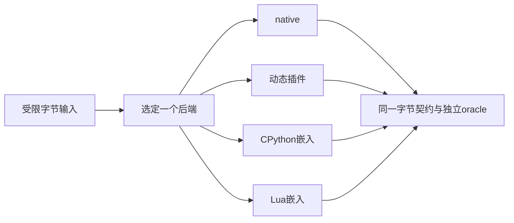

# 21：把各层责任接回同一条记录

前面的局部实验故意把问题拆开：L02只证明字节与失败提交，L04处理并发关闭，Python/Lua各自验证对象和运行时。P1的任务是把这些责任接成一条能解释的实际调用链，而不是再发明一套统一所有语言的对象系统。

## 从串行基线开始集成

P1先使用native内核，再用真实动态插件。CLI在进入后端之前验证十六进制输入并限制解码大小；输入/输出容器由C++调用方持有，结果输出成十六进制。插件路径中，模块owner先建立、函数表协商成功、context创建成功，才调用process；process结束后显式检查close结果。

P1的 `SerialPlugin` 不允许并发成员调用，也不保存回调。它是明确边界内的朴素正确基线，不把L04更复杂的协议悄悄藏进一个通用基类。要引入长期对象或并发任务，先回到L04补齐准入、lease和drain，再扩展集成测试。

## 相同数据契约，不同对象协议

Python后端必须实际创建/调用相应运行时，结果复制回C++拥有的vector后，所有Python引用才释放，随后关闭解释器。Lua后端必须通过受保护C入口建立栈上的输入/函数和返回值，C++在合法存活范围内复制结果，再关闭state。默认没有对应依赖时，程序明确拒绝该后端，不回退native。

对读者而言，最重要的跟踪对象不是“backend枚举”，而是每个地址背后的owner。Python对象被DECREF后，其中bytes地址可能失效；Lua栈弹出值且没有其他可达引用时，地址不能继续被当成拥有内存；插件模块释放后，函数指针、虚表或deleter也不能继续使用。

## 失败路径必须回到创建点

输入非法时还没进入后端，应直接报告解析错误。协商失败时还没创建业务context，只需处理模块owner。业务失败时仍需收束和关闭；不能因转换失败跳过清理，也不能先输出“成功”再发现close失败。

P1分别检查native、plugin、Python、Lua。检查器使用独立查表oracle，覆盖空记录、嵌入NUL、高位字节及完整256字节集合。某个后端运行错误只说明那个路径失败；把它换成native让测试通过，会失去原始实验的对象。

## 进程内信任边界

原生插件能够执行进程内代码；Lua/Python的资源预算也不是安全沙箱。本课自动实验使用受控插件和脚本，不加载用户未知二进制。若真实产品需要运行不可信代码，进程隔离、权限和IPC属于新的架构责任，应沿C07/C11建立独立协议与故障实验，而不是给同一进程加一个超时标志就宣称隔离完成。

## 把Clang工具接回真实接口

P2消费P1实际使用的ABI头。check找出危险的导出签名；rewrite迁移受控源码副本；generate输出清单及可编译契约检查代码。生成成功以后仍要让C/C++消费者构建，并对运行时协议做原来的检查。静态工具不可能仅凭函数名字证明对象生命周期正确。

## 集成自测与解析

1. **为何不把四个后端写成同一套owner？** 它们共享业务数据契约，运行时销毁、错误和线程规则却不同。保留真实边界比用抽象抹平差异更容易验证。
2. **主项目为什么先保持串行？** 这样输入、状态和代码owner的生命周期都在可跟踪作用域内。并发必须由需要它的场景和受控证据引入，不能作为默认复杂度。
3. **转换结果正确但close失败应怎样报告？** 整次操作未完成约定清理，不能报告完整成功。保留失败和可重试所有权，再按相应协议收束。
4. **P2没有编译环境时能否交付P1？** 可分别完成P1的可运行路径，并保留P2完整材料与未验证说明；不能把一条路线的结果替另一条填PASS。
